### 좌표값에 따른 RGB Classfication 

- 은닉 층은 2개의 Layer로 구성될 것
- 입력층 노드 3개 : x,y,z 좌표, 출력층 노드 3개 : RGB
- 출력층 target 값은 원하는 색깔로 1.0, 0.0, 0.0 식
- 3차원 좌표로 나타낼 수 있는 공간에서 3개의 영역을 구분하는 신경망
- 학습데이터는 200개 이상을 임의로 만들기

- 200개 전체를 학습하는 과정은 총 5번 반복
- 테스트 데이터에 대해 순전파 진행하고 그 결과를 확인하고 target과 비교할 것 

---

#### 편미분의 수식전개를 활용해 "계산된 값 의 곱"을 활용해 역전파를 구현
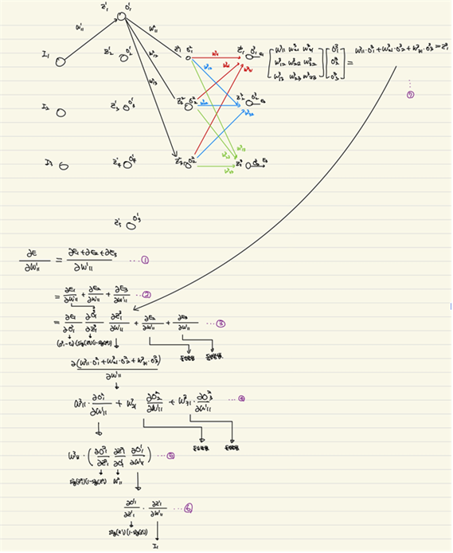

$W^n_{ij}$ : n Layer 에 해당하는 i번 노드 에서 j번 노드로 들어가는 가중치</br>
$Z^n_{K}$ : n-1 Layer로 부터 n Layer로 입력값의 합산</br>
$O^n_{K}$ : $Z^n_{K}$ 를 Sigmoid 함수를 취한 값. n Layer의 k노드의 출력.</br>
$W_{ij}$ :i~j 레이어로 통하는 가중치 

#### 활성함수 : Sigmoid
$$
\frac{1}{1+e^{-x}}
$$

---

#### 학습 데이터 셋 구성

<a href="Learning_Data_Generator.c">랜덤 데이터 셋 생성</a>


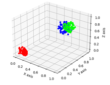 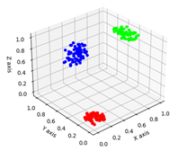

좌표내 3개의 구분이 되는 영역</br>
xyz(0,0,0) 부터 거리가 0.2 이하인 영역 R</br>
xyz(1.0,0.5,1.0) 부터 거리가 0.2 이하인 영역 G</br>
xyz(0.5,1.0,0.5) 부터 거리가 0.2 이하인 영역 B</br>

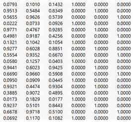
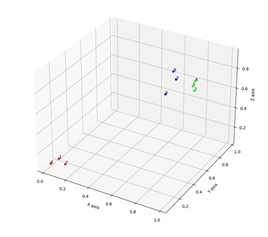

#### 학습 진행

##### 1.1 한 개의 Input, 한 개의 Target
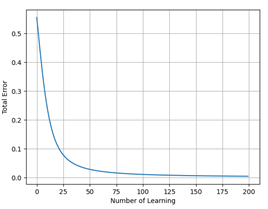
```c++
    double Input[INPUT_SZ] = {0.1 , 0.1 , 0.1};
    double target[OUTPUT_SZ] = {1,0,0};
```
- 임의의 초기값을 Input과 Target에 각각 넣었을 때
- 한 개의 데이터를 200번 학습시킬 것

##### 1.2 200 개의 Input, 세 개의 Target, 한 번의 Epoch
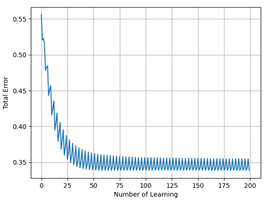
- Target이 달리지기 때문에 오차가 상승되는 지점 발생
- 이 후 RGB 가 구분되는 학습데이터가 번걸아 가며 순차적으로 학습이 진행되기 떄문에 특정 값(0.35) 에 수렴하는 값 존재

##### 1.3 200 개의 Input, 세 개의 Target, 5번의 Epoch
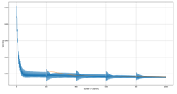
- 한 Epoch인 200개 마다 오차함수의 파형이 반복되고 있다. 
- 학습이 전혀 진행되고 있지 않아 보이지만, 주황색 선(200개의 데이터셋에 대한 오차의 평균) 을 보면 점차 감소하고 있는 모습이 보인다.

##### 1.4 200 개의 Input, 세 개의 Target, 100번의 Epoch
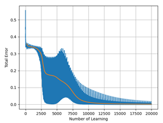

- 100 Epoch 진행
- 0.35로 수렴하던 오차는 13Epoch 부근에서 점차 감소하기 시작
- 평균(주황색 선) 은 지속적으로 감소하였다.
- 이후 Total 오차가 0부근으로 수렴했으며, 학습이 진행되었다.

---

#### 색 분류 검증

#### Epoch 5
$$(0.35, 0.89, 0.82)$$
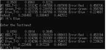

인간이라면 정답을 단번에 알 수 있는 Blue에 해당하는 영역</br>
하지만 해당 신경망은 Green 이라고 분류하였다.


해당 검증작업을 반복한 결과 20개의 TestCase는 전부 Green 색상이라고 판단하였다.
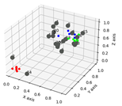
- 입력된 좌표가 전부 비슷한 색을 띄었다. (분류가 제대로 되지 않다.)

---

#### Epoch 100
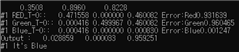

학습횟수를 크게 늘려 100 Epoch 일 떄를 살펴보자.

첫번째 TestCase에 대해 정확히 분류하였다.
RedTarget(1,0,0) </br>
GreenTarget(0.1.0) </br>
BlueTarget(0,0,1) </br>

이후 19번의 추가적은 검증을 진행 했을 때 역시, 완벽히 분류했다. (보고서 참조)

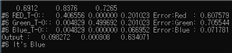

다만 6번 테스트케이스에 대해 살펴볼 필요가있다.
Green의 기준 포인트와 Blue의 기준 포인트의 중점이 있기 때문에 어디에 더 편향되어 있는지에 따라 판정이 달라질 수 있다.

