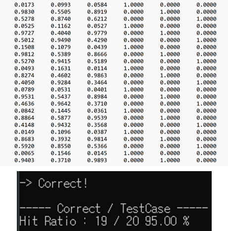
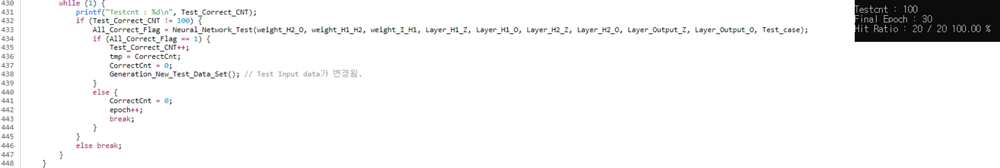
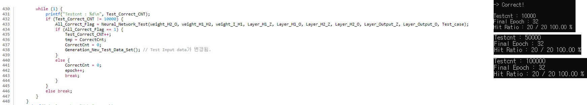

### 최적의 Epoch 수 찾기
이전 인공지능2 에서 임의로 지정하였던 5 Epoch 로는 학습이 제대로 이루어 지지않았음

따라서 Epcoh를 늘려가며, TestCase가 전부 구분이 되는 Epoch를 찾아보았다.

20개의 정답을 전부 도출해낸 Epoch의 수는 26.  
하지만 이것은 단지 TestCase에 대한 구분을 위한 학습 Epoch 일 뿐  

다른 테스트 케이스에 대해선 정답을 도출해 내지 못할 수 있음

또다른 TestCase 20개를 가지고 결과를 도출하였다. 
20개의 TestCase 중 19개의 정답을 도출해냈으며, 한 개의 TestCase 에 대해선 오답을 제시

코드를 조금 수정하여 보자.

---

Test_Correct_CNT 는 테스트의 반복횟수.

Test를 진행하였을 때 20개가 전부 도출을 해냈으면 CNT++  
또다른 난수 테스트케이스를 20개 생성하여 테스트를 진행  
만약 하나라도 틀리게 되면 Epoch을 늘력 다시한번 학습을 진행하게 된다.

