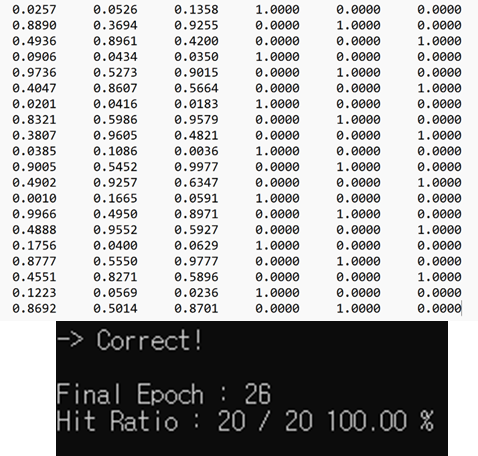

### 최적의 Epoch 수 찾기
이전 인공지능2 에서 임의로 지정하였던 5 Epoch 로는 학습이 제대로 이루어 지지않았음

따라서 Epcoh를 늘려가며, TestCase가 전부 구분이 되는 Epoch를 찾아보았다.




20개의 정답을 전부 도출해낸 Epoch의 수는 26. </br>
하지만 이것은 단지 TestCase에 대한 구분을 위한 학습 Epoch 일 뿐 </br>

다른 테스트 케이스에 대해선 정답을 도출해 내지 못할 수 있음


또다른 TestCase 20개를 가지고 결과를 도출하였다. 
20개의 TestCase 중 19개의 정답을 도출해냈으며, 한 개의 TestCase 에 대해선 오답을 제시


코드를 조금 수정하여 보자.

---

Test_Correct_CNT 는 테스트의 반복횟수.


Test를 진행하였을 때 20개가 전부 도출을 해냈으면 CNT++ </br>
또다른 난수 테스트케이스를 20개 생성하여 테스트를 진행 </br>
만약 하나라도 틀리게 되면 Epoch을 늘력 다시한번 학습을 진행하게 된다.

---


5 Epoch를 진행했을 때 학습이 충분히 진행되지 않아 색상정보의 RGB가 전부 같은 값을 띄고 있음.
이후 시뮬레이션을 통해 얻은 충분한 Epoch 수인 32번의 경우 비교적 분류가 잘 되고 있는 모습을 보이며, 이보다 더 많은 Epoch를 진행 시 더 확실하게 분류를 진행한 모습을 볼 수 있다.

---

### 가중치의 변화


- 임의로 Epoch 수를 늘려(100) 실험 - 가중치가 일정 에폭 이후로 수렴하는 모습을 볼 수 있다.


### 가장 큰 영향의 가중치

총 가중치는 39개
그 중 세 개를 뽑을 때 나올 수 있는 경우의 수 $$_{39}C_3 = 9139$$
충분히 학습을 하여 완벽히 분류를 수행 할 수 있는 100Epoch 기준
가장 정답률이 낮은 기록을 하는 가중치 세개를 영향을 많이 끼친 가중치라고 가정.

```C++
int arr[39] = {111,112,113,114,115,
               121,122,123,124,125,
               131,132,133,134,135,

               211,212,213,
               221,222,223,
               231,232,233,
               241,242,243,
               251,252,253,

               311,312,313,
               321,322,323,
               331,332,333};

void combination(int N, int R, int q){
    if(R == 0){
        for(int i = q - 1; i >= 0; i--){
            Selected_weightt[cnt][i] = A[i];
        }
        cnt++;
    }
    else if(N < R){
        return ;
    }
    else{
        A[R-1] = arr[N-1];
        combination(N-1, R-1, q);
        combination(N-1, R, q);
    }
}
```
combination() 함수를 통해 Selected_weight[9139][3] 배열에 각 조합에 대한 가중치의 위치 정보를 저장


- 이 후 가중치 위치 정보 가공, 가중치 0으로 설정 등의 실험을 반복


Answer 조합은 가중치 위치정보 252,331,332 를 반환 


